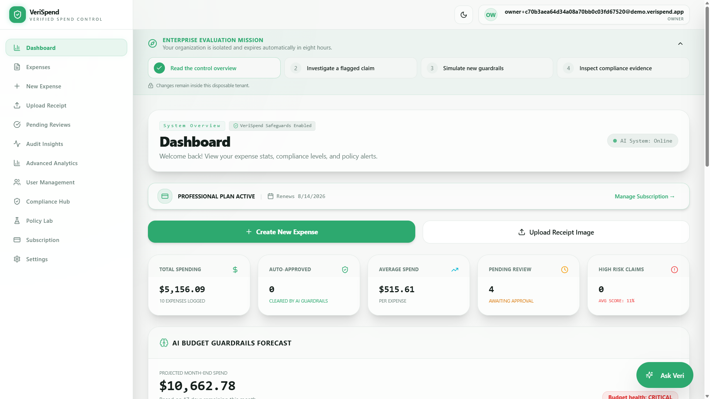
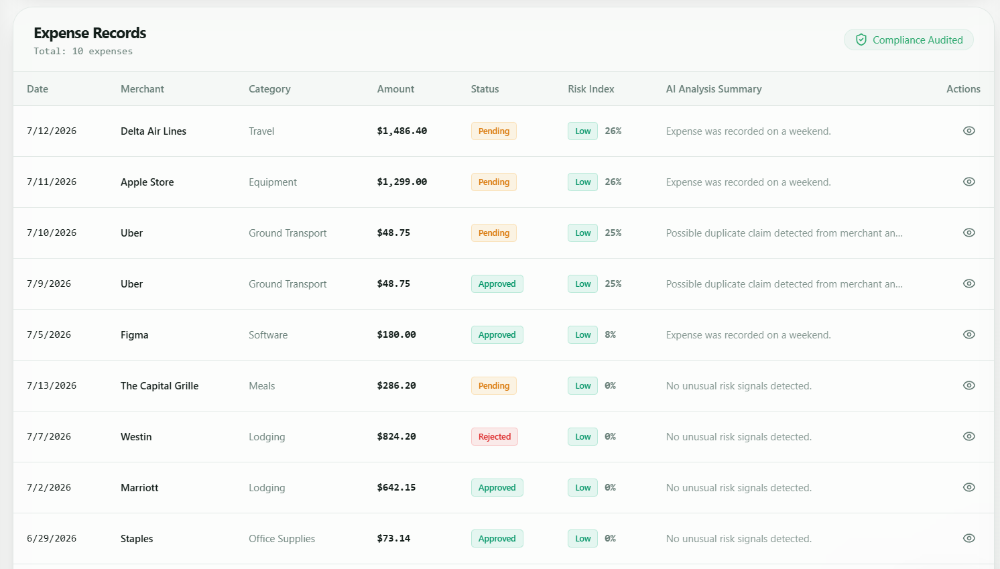
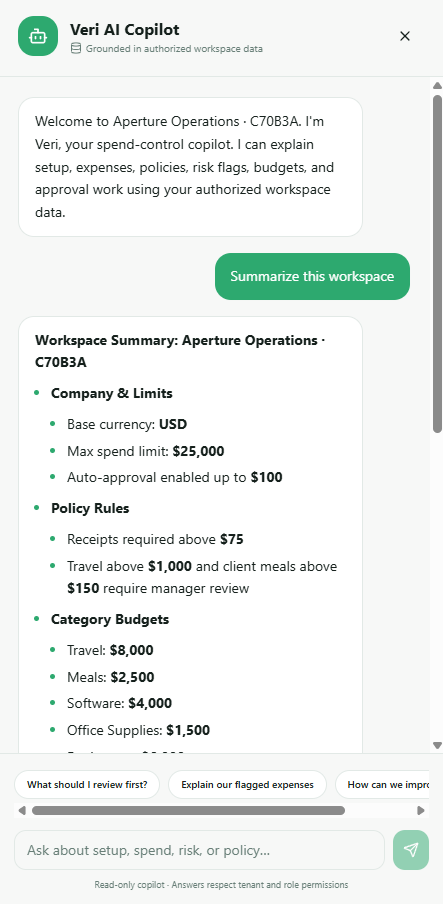
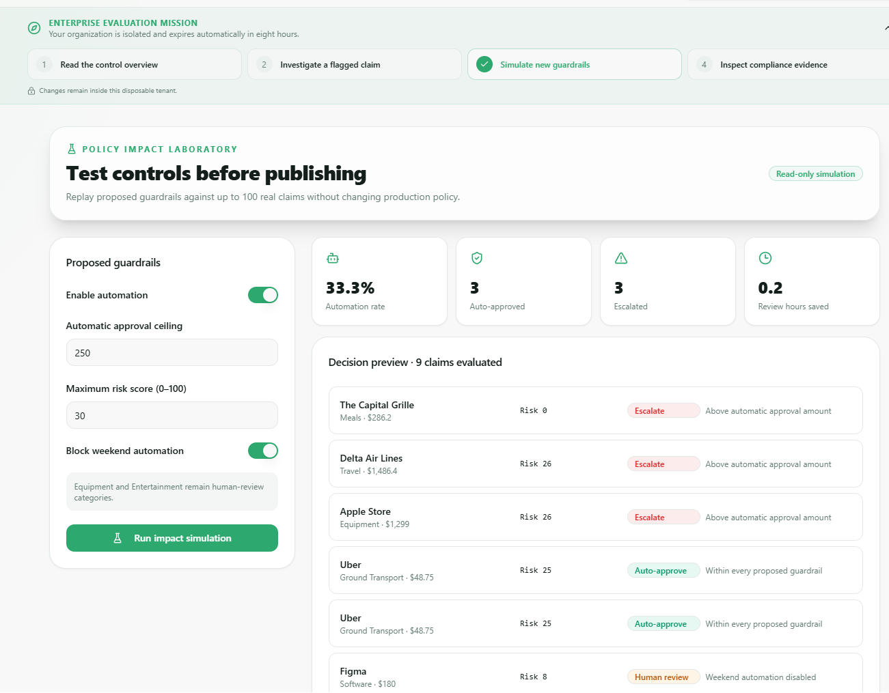

# VeriSpend

VeriSpend is an AI-assisted expense review system for small organizations. It reduces manual receipt entry and makes inconsistent or risky claims easier to review, while keeping approval authority and company data under backend-enforced controls.

- [Live application](https://aiaudit-expensetracker-web.onrender.com)
- [API documentation](https://aiaudit-expensetracker.onrender.com/swagger)

> The free hosted backend may take about one minute to wake up. Use **Explore populated demo** for an isolated temporary workspace.

## The problem

Small organizations need a consistent way to submit, review, and audit expenses without exposing one company's data to another.

Manual entry wastes time. Informal review produces inconsistent decisions. Managers need to know which claims deserve attention and why. Owners also need durable evidence of who changed or approved an expense. AI can assist with extraction and explanation, but it must not become an unaccountable financial decision-maker.

## One complete scenario

1. An employee uploads a receipt.
2. The vision provider proposes merchant, total, currency, date, and category.
3. VeriSpend marks uncertain or fallback results for manual review; the employee can correct every field before creating a draft.
4. Backend policy and risk rules check limits, duplicates, unusual activity, restricted categories, missing details, and budgets.
5. The employee submits the draft.
6. An authorized Owner or Manager sees the risk score, triggered rules, anomalies, and review explanation.
7. The manager approves or rejects the claim.
8. Creation, edits, submission, and the decision are recorded in the audit history with the actor and before/after state.

The guided demo contains representative safe, duplicate, over-limit, weekend, and restricted-category claims so this workflow can be reviewed without using real company data.

## Why these features exist

| Business problem | VeriSpend response | Evidence |
| --- | --- | --- |
| Manual receipt entry | Vision-assisted field proposals and an editable confirmation form | [Receipt evaluation](docs/receipt-evaluation/README.md), upload UI |
| Inconsistent reviews | Deterministic risk and policy signals with manager-facing explanations | `RiskAssessmentServiceTests` |
| Cross-company data exposure | Tenant ID is derived from authenticated claims and applied to repository queries | `ClaimsPrincipalExtensionsTests`, tenant-scoped repositories |
| Missing audit evidence | Created, updated, submitted, approved, rejected, and deleted events include snapshots and actor details | `AuditLogService`, populated demo audit histories |
| Policy and budget violations | Spend limits, restricted categories, duplicate checks, and category budget alerts | `RiskAssessmentServiceTests`, `BudgetGuardrailService` |
| Too many claims to inspect equally | Risk level, reasons, policy triggers, and anomaly flags prioritize review | manager pending queue and expense detail UI |

## Guardrails and decision authority

- Authentication and role authorization are enforced by ASP.NET Core controllers. Manager endpoints require the `Owner` or `Manager` role.
- Tenant identifiers come from the authenticated principal; clients do not select a tenant for protected expense queries.
- Expense repositories include the tenant ID when loading individual or organization-wide records.
- Extracted values are proposals. Users can edit them before a draft is created.
- Missing AI configuration, provider errors, malformed responses, and unsupported files fail safely. The API returns incomplete values, `requiresReview: true`, and warnings instead of fabricated receipt facts.
- AI receipt extraction and the copilot do not call approval or rejection services.
- Normal final decisions are made through role-protected manager endpoints and recorded in the audit log.
- Optional auto-approval is an Owner-configured deterministic policy workflow, not a model decision. It is disabled unless explicitly enabled and is disclosed separately in settings and audit history.
- The copilot receives only expenses already filtered for the authenticated tenant and role.

## Receipt extraction evaluation

The committed evaluation is deliberately small and transparent: three anonymized/template receipt files (two copies of one raster receipt and one SVG receipt), five fields per file, evaluated with the configured Mistral vision model on 17 July 2026.

| Field | Accuracy |
| --- | ---: |
| Merchant | 66.7% |
| Total amount | 66.7% |
| Currency | 66.7% |
| Transaction date | 66.7% |
| Category | 66.7% |
| **Overall field accuracy** | **66.7% (10/15)** |

Both PNG evaluations were correct on all five fields. The SVG request was not accepted/parsed by the provider path and used the safe fallback, so all five fields were counted as incorrect. This shows the primary current failure case rather than hiding it. The two PNGs are duplicate files, so these results are a pipeline check—not a statistically meaningful production benchmark.

See [the evaluation protocol and raw results](docs/receipt-evaluation/README.md). Re-run it with:

```powershell
dotnet run --project tools/ReceiptEvaluator/ReceiptEvaluator.csproj -- docs/receipt-evaluation/dataset.json docs/receipt-evaluation/results.json
```

## Architecture

```text
React client
  │ authenticated HTTPS / editable receipt review
  ▼
ASP.NET Core API
  ├─ authorization and tenant context
  ├─ expense workflow and audit logging
  ├─ deterministic risk, policy, and budget services
  └─ AI adapters for receipt extraction and tenant-scoped copilot context
  │
  ▼
PostgreSQL (tenant-owned users, expenses, receipts, policies, and audit logs)
```

The boundary is intentional: AI proposes or explains; backend services authorize, persist, evaluate policy, and record decisions.

## Product preview

### Finance control dashboard



### Expense records and risk analysis



### Tenant-scoped AI copilot



### Policy impact simulation



## Major design decisions

- **Human-editable extraction:** receipt output is never persisted as an expense until the user confirms it.
- **Explainable deterministic risk:** review scores are assembled from visible rules rather than a model-generated approval recommendation.
- **Tenant scoping in the backend:** UI hiding is not treated as an access-control boundary.
- **Audited state transitions:** workflow events capture actors and snapshots, not only the latest status.
- **Safe degradation:** core expense entry remains available without an AI key; unavailable extraction is clearly labelled and requires manual input.

## Limitations

- The current receipt benchmark is too small and contains a duplicate image. It validates the evaluation pipeline but not real-world generalization.
- SVG input is accepted by the browser but may not be supported by the configured vision endpoint; the UI rasterizes SVG uploads where possible.
- No calibrated, provider-supplied per-field confidence score is available. VeriSpend therefore uses explicit completeness checks and conservative fallback warnings rather than displaying invented confidence percentages.
- Merchant naming and expense category ground truth can be subjective; the evaluation uses exact normalized matching and documents labels.
- Policy and anomaly rules are heuristics and require organization-specific configuration.
- Compliance screens support evidence collection; they do not by themselves make an organization SOX, SOC 2, or GDPR compliant.
- Optional deterministic auto-approval changes the human-only workflow and should be enabled only after owners validate its rules.

## Run locally

Requirements: .NET 10, Node.js 20+, npm, and PostgreSQL.

```powershell
Copy-Item server/appsettings.Development.example.json server/appsettings.Development.json
dotnet run --project server
```

In another terminal:

```powershell
cd client
npm install
npm run dev
```

Open [http://localhost:5173](http://localhost:5173). Add PostgreSQL, JWT, and optional AI-provider settings only to the ignored development configuration. Without an AI key, receipt extraction enters explicit manual-review fallback mode.

For Docker:

```powershell
Copy-Item .env.example .env
docker compose up -d --build
```

## Tests

```powershell
dotnet test VeriSpend.sln

cd client
npm test
npm run build
```

Backend tests cover risk signals, fail-closed tenant claims, demo audit evidence, and safe receipt fallback. The test suite should next add database-backed integration tests that attempt cross-tenant reads and exercise the complete approval workflow over HTTP.

## Project structure

```text
client/                     React application
server/                     ASP.NET Core API
server.Tests/               backend unit and guardrail tests
docs/receipt-evaluation/    labels, raw predictions, protocol, and results
tools/ReceiptEvaluator/     reproducible live-provider evaluation runner
compose.yaml                local application stack
```
