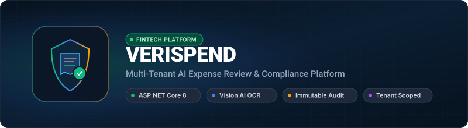
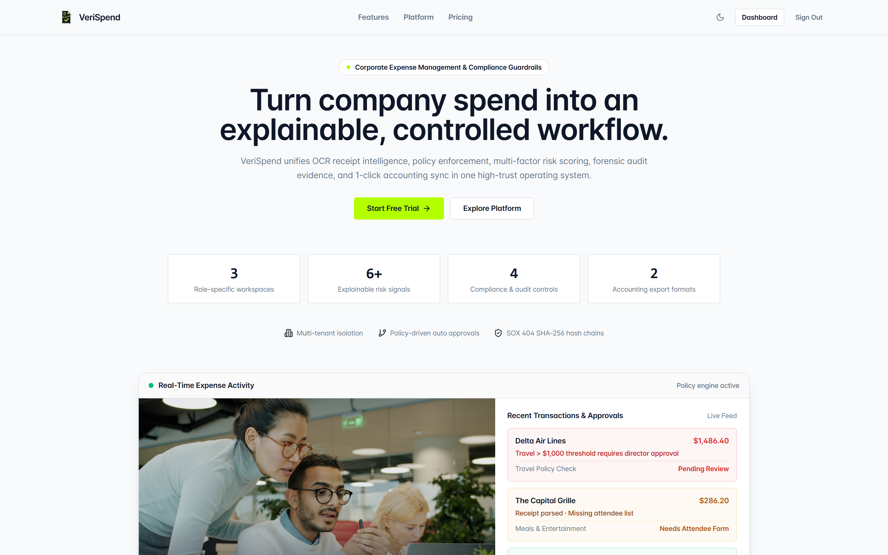
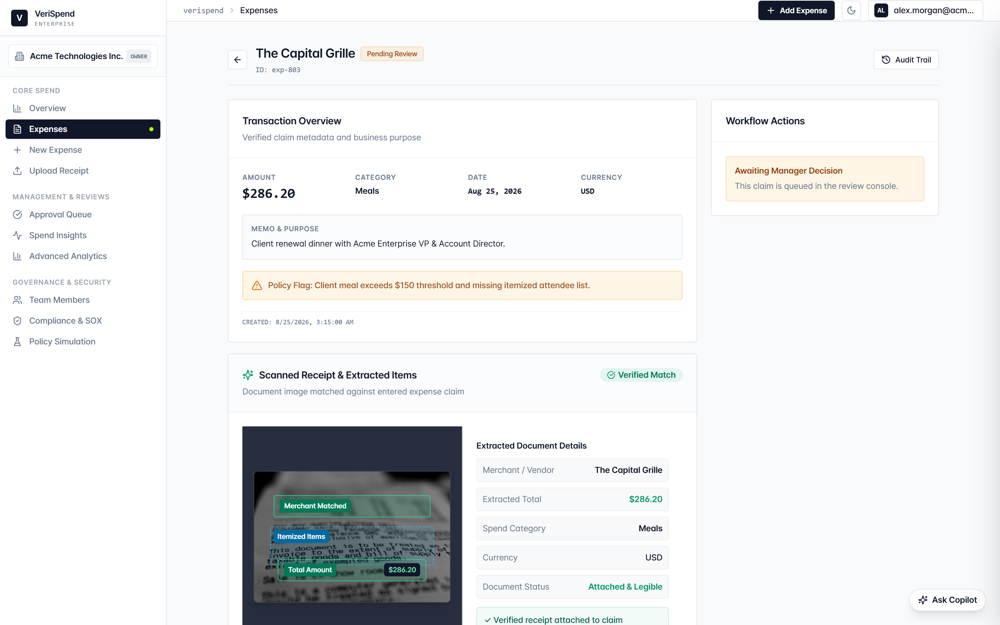
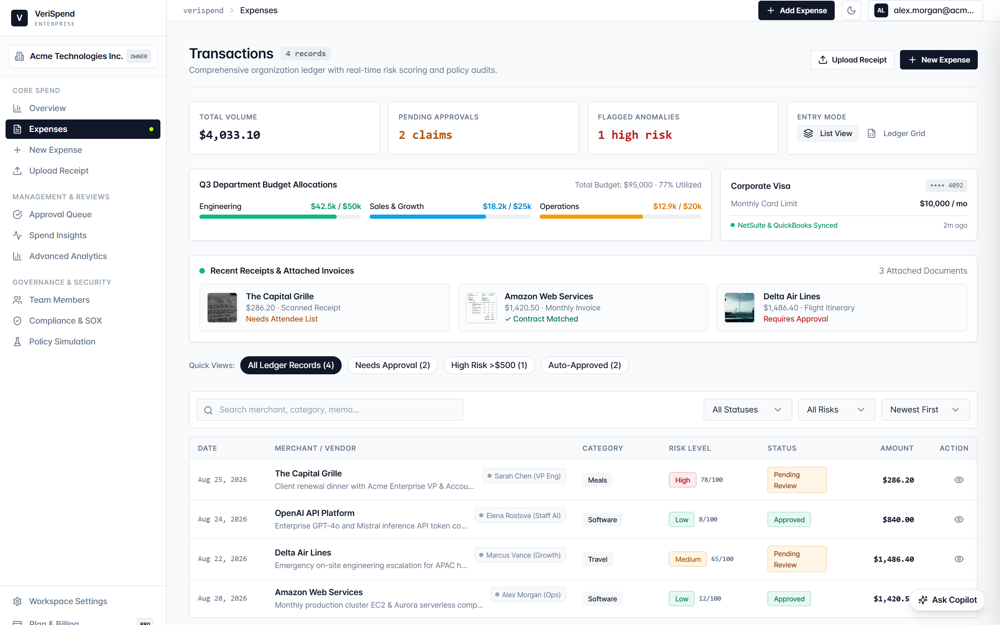
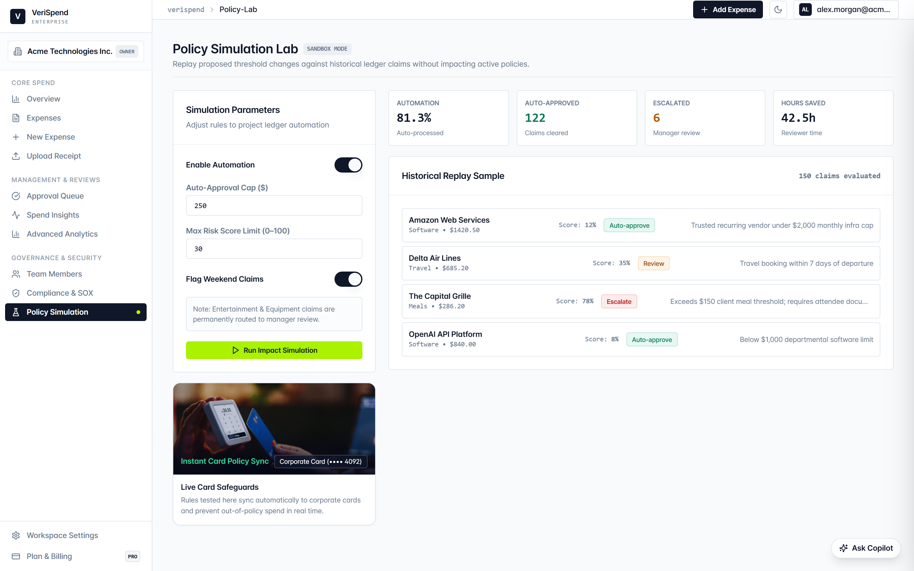

<p align="center">
  
</p>

<p align="center">
  <strong>A multi-tenant corporate expense review platform that automates itemized receipt parsing with Vision AI, enforces spend limits, and maintains immutable audit logs.</strong>
</p>

<p align="center">
  <a href="https://verispend-client.onrender.com"></a>
  <a href="https://aiaudit-expensetracker.onrender.com/swagger"></a>
  
  
  
  
  
  
</p>

---

## Platform Visual Preview

| Platform Landing & Review Queue | Vision AI Extraction & Proposal |
|:---:|:---:|
|  |  |
| **Expense Detail & Line-Item Audit** | **Policy Lab & Compliance Guardrails** |
|  |  |

---

## DevOps & Infrastructure

VeriSpend is containerized with Docker Compose and deployed through continuous integration workflows.

### End-to-End Architecture

```text
React 19 Client
        │
        ├── Authenticated HTTPS / Editable Receipt Review Form
        │
        ▼
ASP.NET Core 8 API
        │
        ├── JWT Claims Principal ────► Injects Tenant Isolation Scope
        │
        ├── Policy Engine ───────────► Evaluates spend limits, duplicates & restricted categories
        │
        ├── Mistral Vision AI ───────► Extracts itemized lines, totals, taxes, and currencies
        │
        ├── EF Core Interceptors ────► Appends immutable JSON state snapshots on save
        │
        └── Approval State Machine ──► Role-gated transitions (Owner / Manager / Employee)
        │
        ▼
PostgreSQL Database (Tenant-partitioned expenses, receipts, policies, and audit logs)
```

### Services

| Service | Technology | Role |
|---|---|---|
| API Backend | ASP.NET Core 8 (C#) | REST API, JWT auth, tenant isolation, business logic |
| Client | React 19 + TypeScript | Single-page application, interactive expense spreadsheet grid |
| Vision AI Engine | Mistral Vision API | OCR parsing of merchant, totals, taxes, date & category |
| Database | PostgreSQL 16 | Relational persistence, JSONB state snapshots, indexes |
| Containerization | Docker + Compose | Multi-container local orchestration & production builds |

### Key Infrastructure Decisions

- **Tenant Scoping at Data Layer** — Tenant ID is extracted strictly from the authenticated JWT token and applied to all repository queries; the UI has no authority over tenant boundaries.
- **Immutable Audit Logging** — Entity Framework Core interceptors automatically capture actor identities and before/after JSON state snapshots on every update and approval transition.
- **Fail-Safe Vision Fallback** — If AI extraction is unavailable or malformed, the system falls back safely to manual review with clear warning flags instead of fabricating receipt facts.
- **Deterministic Risk Scoring** — Compliance risk signals are computed from deterministic rules (spending caps, weekend transactions, missing details) rather than unexplainable black-box models.

---

## Features

- **Vision AI Receipt Extraction**: Parses raw receipt images into structured fields (merchant, line items, taxes, currency, date, category).
- **Human-in-the-Loop Confirmation**: Field proposals are fully editable before creating draft expenses.
- **Multi-Tenant Workspace Isolation**: Strict tenant data partitioning backed by claims-based authorization.
- **Deterministic Policy Guardrails**: Real-time spending limits, duplicate submission detection, and restricted category rules.
- **Immutable Audit History**: Append-only JSON ledger recording all state changes, actors, timestamps, and previous values.
- **Role-Based Workflow**: Dedicated interfaces and permissions for Employees (submit), Managers (review/approve), and Owners (policy setup).

---

## Tech Stack

- **Frontend**: React 19, TypeScript, Vite, Tailwind CSS, Radix UI
- **Backend**: ASP.NET Core 8 / .NET 10, C#, Entity Framework Core
- **Database**: PostgreSQL 16, EF Core Migrations
- **AI & Vision**: Mistral Vision API, Custom Evaluation Harness
- **Infrastructure & Testing**: Docker, Docker Compose, xUnit, Vitest, Playwright

---

## Getting Started

### 1. Clone repository & configure environment

```bash
git clone https://github.com/ttnhan227/VeriSpend.git
cd VeriSpend
cp .env.example .env
```

### 2. Start with Docker Compose

```bash
docker compose up -d --build
```

| Endpoint | URL |
|---|---|
| Web Application | http://localhost:5173 |
| Swagger API Docs | http://localhost:8080/swagger |
| Health Check | http://localhost:8080/health |

---

## Environment Variables Reference

| Variable | Description | Default / Example |
|---|---|---|
| `ASPNETCORE_ENVIRONMENT` | Runtime environment (`Development` or `Production`) | `Development` |
| `ConnectionStrings__DefaultConnection` | PostgreSQL connection string | `Host=postgres;Port=5432;Database=verispend;Username=postgres;Password=...` |
| `Jwt__Secret` | HMAC-SHA256 secret key for signing JWT tokens | `min-32-chars-secret-key-for-jwt-signing` |
| `Jwt__Issuer` | JWT token issuer | `VeriSpendAPI` |
| `Jwt__Audience` | JWT token audience | `VeriSpendClient` |
| `Mistral__ApiKey` | Mistral Vision API Key for receipt extraction | Required for AI OCR |
| `Mistral__Model` | Vision language model identifier | `pixtral-12b-2409` |
| `VITE_DEMO_ENABLED` | Enables public demo workspace switch | `true` |

---

## Testing & Quality Assurance

### Backend xUnit Tests

```powershell
dotnet test VeriSpend.sln
```

14 unit and integration test suites covering:
- Tenant-scoped repository queries & data leakage prevention
- EF Core audit trail interceptors and JSON state snapshot generation
- Deterministic policy limit validation & duplicate expense checks
- Currency conversion calculations and fallback modes

### Frontend Tests

```bash
cd client
npm test        # Unit tests (Vitest)
npm run build   # Production bundle verification
```

---

## Local Development (Without Docker)

### Backend

```powershell
Copy-Item server/appsettings.Development.example.json server/appsettings.Development.json
dotnet run --project server
```

### Frontend

```bash
cd client
npm install
npm run dev
```

---

## License

MIT
