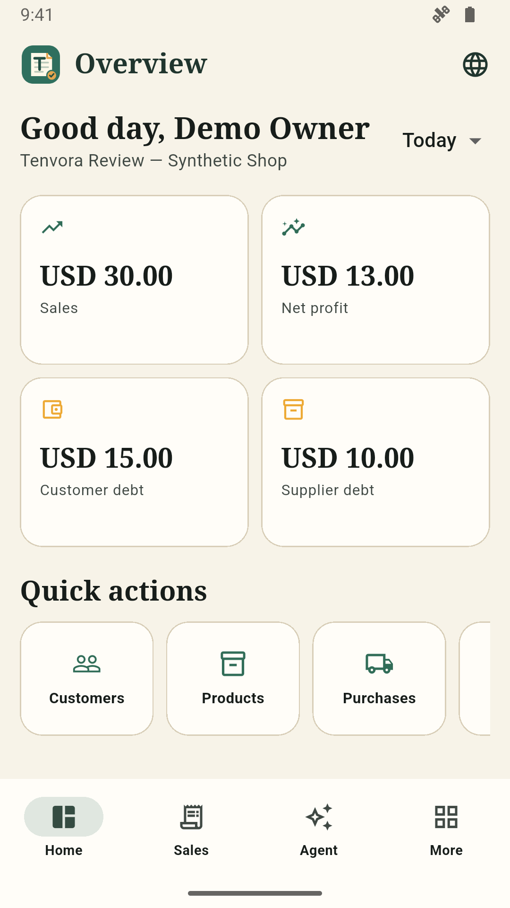
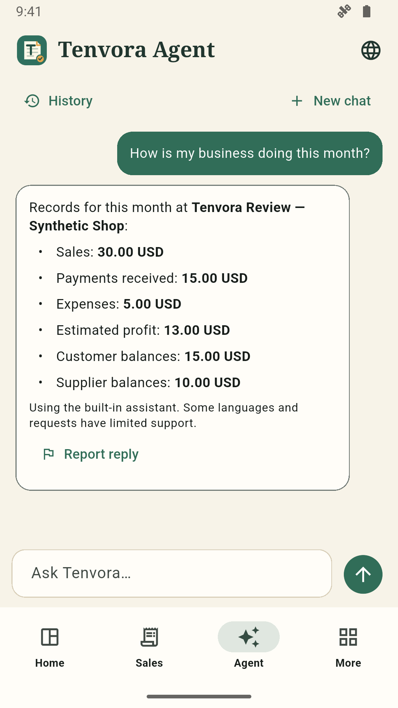

# Tenvora

<p align="center">
  
</p>

<p align="center">
  <strong>Deterministic Business Management & Ledger Platform for Local Enterprises</strong>
</p>

<p align="center">
  <a href="https://github.com/ttnhan227/Tenvora/actions/workflows/ci.yml"></a>
  <a href="https://github.com/ttnhan227/Tenvora/actions/workflows/build-mobile.yml"></a>
  
  
  
  
</p>

---

## 📌 Overview

**Tenvora** is a business-management system built for small and local businesses (retail, wholesale, supply shops). It replaces informal credit notebooks, scattered paper receipts, and manual spreadsheets with an append-only financial ledger, real-time debt tracking, and an integrated native mobile companion.

The architecture enforces strict mathematical invariants on the server: atomic transactions, row-level concurrency locks (`SELECT FOR UPDATE`), double-spend prevention, and immutable before/after audit snapshots.

---

## Inside the app

Tenvora keeps sales, customer balances, inventory, expenses, and reports in one workspace. The Android app uses the same business data, so a counter sale or camera receipt is available on the web without copying it manually.

| Business overview | AI assistant |
| :---: | :---: |
|  |  |

The screenshots show the current English Android application with demonstration business data.

---

## ✨ Key Features

* **📊 Practical Financial Dashboard:** Real-time visibility into today's sales, cash collections, categorized operating expenses, and net profit.
* **👥 Debt & Receivables Ledger:** Track customer and supplier debts, partial payments, credit ceilings, and complete transaction histories.
* **🧾 Camera Receipt Capture:** Snap vendor invoices and store receipts directly from the mobile app to attach them to permanent records.
* **📱 Native Mobile Companion:** Lightweight Android app built with Flutter for fast 5-second counter sales and field operations.
* **🤖 Google Gemini AI Copilot:** Grounded business analysis using `gemini-3.5-flash` with guarded, server-validated action proposals.
* **🔒 Tenant Scoping:** Global query filters on EF Core automatically isolate all data queries by verified JWT tenant ID.
* **🌐 Bilingual Support:** Native English and Vietnamese interface with `₫` VND currency and localized phone formats.

---

## 🏗️ Architecture & Technology

| Component | Stack | Responsibilities |
| :--- | :--- | :--- |
| **Web Frontend** | React 18, TypeScript, Vite, Tailwind CSS, TanStack Query | Web workspace, financial reports, catalog, store management. |
| **Backend API** | ASP.NET Core (.NET 10), Entity Framework Core, Npgsql | Ledger engine, atomic writes, concurrency locks, JWT authentication. |
| **Database** | PostgreSQL 16 (Supabase / Self-hosted) | Multi-tenant relational storage, transaction logs, audit history. |
| **Mobile App** | Flutter 3.x, Dart, Dio, Secure Storage | Android/iOS mobile client, camera receipt capture, offline token cache. |
| **AI Integration** | Google Gemini API (`gemini-3.5-flash`) | Contextual chat, natural-language ledger queries, typed proposals. |
| **DevOps & CI/CD** | GitHub Actions, Docker, Render | Automated testing (161+ tests), Docker images, verified APK builds; explicit publication. |

---

## 📱 Mobile App (Android APK)

Pushes verify the backend, web workflows, PostgreSQL payments/recovery, and mobile tests, then build an APK as a GitHub Actions artifact. They do not publish an APK. When ready, run **Build & Release Mobile APK** manually with **publish** enabled; publication requires production signing secrets, an HTTPS backend URL, and the Google server client ID.

* **Direct Download:** [Latest Android APK (`tenvora-mobile.apk`)](https://github.com/ttnhan227/Tenvora/releases/download/mobile-latest/tenvora-mobile.apk)
* **Release Channel:** [GitHub Releases (`mobile-latest`)](https://github.com/ttnhan227/Tenvora/releases/tag/mobile-latest)
* **In-App QR Install:** Navigate to `/mobile` on the web client to scan the QR code and download directly to any Android phone.

---

## 🚀 Quick Start (Local Development)

### Prerequisites
* [.NET 10 SDK](https://dotnet.microsoft.com/)
* [Node.js 22+](https://nodejs.org/) & `npm`
* [Docker Desktop](https://www.docker.com/) *(optional for containerized runs)*

### 1. Clone & Setup
```bash
git clone https://github.com/ttnhan227/Tenvora.git
cd Tenvora
cp .env.example .env
```
Configure your connection string and API keys in `.env`.

### 2. Run Locally

#### Option A: Native Hot-Reload (Recommended for Daily Coding)
Run the backend and frontend separately in two terminals:

```bash
# Terminal 1: Backend API (http://localhost:5000)
dotnet run --project server/Tenvora.Api.csproj

# Terminal 2: Web Client (http://localhost:5173)
cd client
npm install
npm run dev
```

#### Option B: Full Stack via Docker
```bash
docker compose up --build
```

---

## 🧪 Automated Testing & Verification

The codebase includes an automated test suite enforcing ledger invariants, concurrency limits, and UI functionality:

```bash
# Backend Tests (100 xUnit tests verifying ledger math & tenant boundaries)
dotnet test Tenvora.sln

# Frontend Unit Tests (64 Vitest tests covering UI components & business services)
cd client
npm test -- --run

# Frontend Linter & Production Build
npm run lint
npm run build
```

---

## 📂 Project Structure

```
Tenvora/
├── client/                 # React 18 + TypeScript frontend application
│   ├── src/
│   │   ├── components/     # UI components, modals, and design system
│   │   ├── contexts/       # Auth & Language (EN / VI) providers
│   │   ├── pages/          # Workspace pages and public landing page
│   │   └── services/       # Typed API clients & Axios interceptors
├── server/                 # ASP.NET Core (.NET 10) backend web API
│   ├── Controllers/        # REST endpoints (auth, sales, products, ai, etc.)
│   ├── Data/               # AppDbContext, migrations, audit interceptors
│   ├── Domain/Entities/    # Tenant-scoped domain models
│   └── Services/           # Ledger calculations, business rules, AI services
├── server.Tests/           # 100 xUnit unit & integration tests
├── mobile/                 # Flutter mobile application
│   ├── lib/                # Mobile app code, camera receipts, state management
│   └── android/            # Native Android packaging & Gradle configuration
└── .github/workflows/      # Automated CI/CD & Mobile release pipelines
    ├── ci.yml              # Tests and Docker images
    ├── verify-product.yml  # PostgreSQL, recovery, backend and browser checks
    ├── deploy-render.yml   # Manual Render deployment after verification
    └── build-mobile.yml    # APK verification; publication is explicitly selected
```

---

## ⚖️ Product Invariant

The relational database and deterministic application services are the ultimate source of truth. All financial calculations, partial payments, and ledger balances are computed exclusively on the server with decimal precision and idempotency protection.
